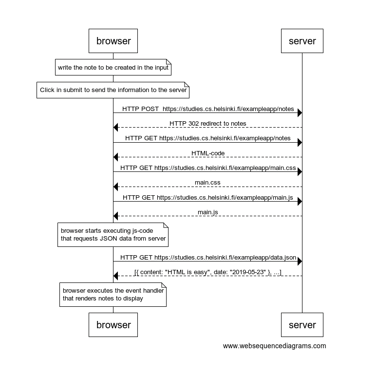

# 0.4 New note

Create a similar diagram depicting the situation where the user creates a new note on page https://studies.cs.helsinki.fi/exampleapp/notes when writing something into the text field and clicking the submit button.

```
note over browser:
write the note to be created in the input
end note

note over browser:
Click in submit to send the information to the server
end note

browser->server:HTTP POST  https://studies.cs.helsinki.fi/exampleapp/notes
server-->browser: HTTP 302 redirect to notes

browser->server: HTTP GET https://studies.cs.helsinki.fi/exampleapp/notes
server-->browser: HTML-code
browser->server: HTTP GET https://studies.cs.helsinki.fi/exampleapp/main.css
server-->browser: main.css
browser->server: HTTP GET https://studies.cs.helsinki.fi/exampleapp/main.js
server-->browser: main.js

note over browser:
browser starts executing js-code
that requests JSON data from server
end note

browser->server: HTTP GET https://studies.cs.helsinki.fi/exampleapp/data.json
server-->browser: [{ content: "HTML is easy", date: "2019-05-23" }, ...]

note over browser:
browser executes the event handler
that renders notes to display
end note
```


