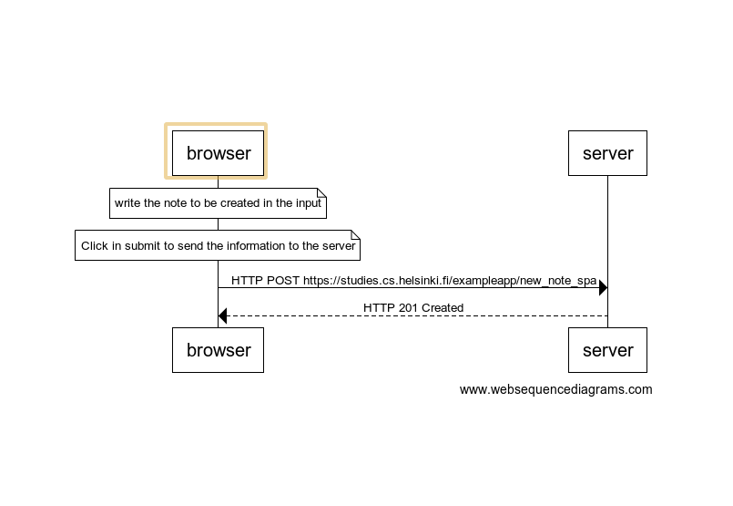

# 0.6 New note

Create a diagram depicting the situation where the user creates a new note using the single page version of the app.

````
note over browser:
write the note to be created in the input
end note

note over browser:
Click in submit to send the information to the server
end note

browser->server: HTTP POST https://studies.cs.helsinki.fi/exampleapp/new_note_spa
server-->browser: HTTP 201 Created

```


